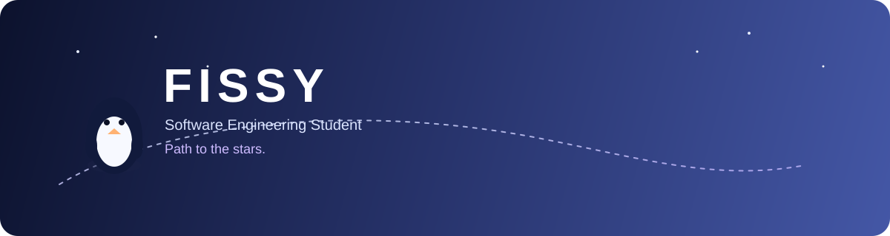

  

 

# FISSY

### Estudiante de Ingeniería Informática · Creador · Entusiasta de la tecnología

 

---

## 🐧 Sobre mí

Soy estudiante de **Ingeniería Informática** interesado en convertir ideas en productos y sistemas reales.

Me gusta trabajar en diferentes partes del desarrollo, desde interfaces y APIs hasta bases de datos, infraestructura, automatización y despliegues.

### Mis principales áreas de interés

* **Ingeniería de Software y Desarrollo Full-Stack**
* **SaaS y desarrollo de productos**
* **Ciberseguridad y aplicaciones seguras**
* **Infraestructura Cloud y DevOps**
* **Automatización e integraciones**
* **Desarrollo de videojuegos y sistemas interactivos**

> 🌌 **Camino hacia las estrellas:** aprender, construir, equivocarme, entender por qué falló y volver a construirlo mejor.

---

## 🚀 En qué estoy trabajando

### 🏢 Fissy's Corp

Una empresa de software, productos digitales e ideas de negocio enfocado en convertir la tecnología en soluciones útiles para el mundo real.

### 🍽️ RestaurantOS

Plataforma de gestión para restaurantes enfocada en las operaciones del día a día.

`POS` · `Mesas` · `Pedidos` · `KDS` · `Domicilios` · `Menú QR` · `Inventario` · `Analíticas` · `Roles` · `REST API`

### 🏨 Hostly

Concepto de plataforma de gestión hotelera enfocada en:

`Reservas` · `Habitaciones` · `Disponibilidad` · `Huéspedes` · `Administración` · `Automatización`

---

<h2 align="center">🌱 Mis Skills</h2>

<h4 align="center">💻 Lenguajes De Programación</h4>

<h4 align="center">📚 Frameworks & Librerias</h4>

<h4 align="center">⚙ Software</h4>

<h4 align="center">☁ Cloud and Providers</h4>

 

---

## 🔐 Ciberseguridad

Me interesa aprender ciberseguridad a través del desarrollo de software y la construcción de sistemas reales.

`Autenticación` · `JWT` · `OAuth` · `Seguridad de APIs` · `Validación de entradas` · `Integraciones seguras` · `Seguridad web`

Mi objetivo es comprender cómo diseñar aplicaciones teniendo la seguridad en cuenta desde el inicio.

---

## 📡 Contacto

 

### 🐧 Construye algo que valga la pena recordar.

 

  

